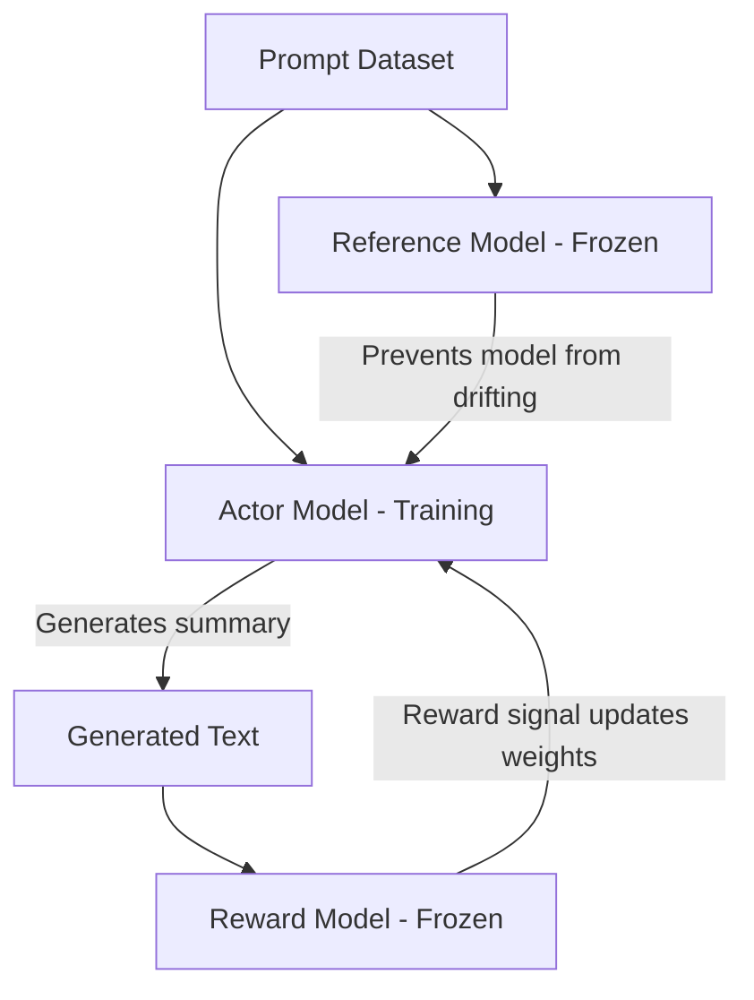

# GPT-2 (124M) From Scratch to RLHF Alignment

This project is a complete pipeline for training a GPT-2 (124M) model from the ground up. I built the foundation of this project by following Andrej Karpathy's amazing "Let's build GPT" tutorial. After getting the base model working, I expanded the project to include the full modern alignment process: supervised fine-tuning, reward modeling, and reinforcement learning.

I trained this entire model on Kaggle using their dual T4 GPU environment, working around their 30 hours per week compute limit.

## 🌐 Live Demo & Resources

- **Web Application**: [https://gpt2-124m-tldr-summarizer.vercel.app](https://gpt2-124m-tldr-summarizer.vercel.app)
- **Model Weights & Card**: [Hugging Face Models (popboat1/gpt2-summarizer-models)](https://huggingface.co/popboat1/gpt2-summarizer-models)
- **Inference API Space**: [Hugging Face API (popboat1/gpt2-summarizer-api)](https://huggingface.co/spaces/popboat1/gpt2-summarizer-api)

## Pretraining

I started by training the raw base model to understand text using the [FineWeb-Edu dataset](https://huggingface.co/datasets/HuggingFaceFW/fineweb-edu). The model ran for 19,703 steps, which covers about 10 billion tokens (one full pass over the dataset), and hit its lowest validation loss at 3.0048. To make sure the model actually learned basic language reasoning and did not just memorize data, I tested it using the HellaSwag benchmark, where it scored 28.95% accuracy. It is worth noting that if the model is trained longer for about 4 epochs, it can achieve approximately 33% accuracy on HellaSwag.

## Supervised Fine-Tuning (SFT)

Once the base model understood English, I needed to teach it how to summarize. I trained it on the [OpenAI Summarize TL;DR](https://huggingface.co/datasets/CarperAI/openai_summarize_tldr) dataset.

The model reached its best validation loss of 2.5321 at step 3400. You can see how the ROUGE scores improved over time in the chart below.

## Reward Modeling

To get ready for reinforcement learning, I trained a reward model. Instead of predicting the next word, this model is trained to act like a human judge. It takes two different summaries, compares them, and learns to give a higher score to the one that reads better.

## Reinforcement Learning (PPO)

I used Proximal Policy Optimization (PPO) to make the model write better summaries based on what the reward model likes.

Here is how the system works:

1. The Actor Model (the model we are training) generates a summary.

2. The Reward Model (frozen) reads the summary and gives it a score.

3. The Reference Model (also frozen) checks the actor model's work to make sure it does not stray too far from normal English (this is called the KL penalty).

4. The actor model updates its weights to get higher scores next time without breaking the language rules.

Here is a diagram showing how the pieces talk to each other:

## PPO Inference Results

Here are a few examples of how the model summarizes posts after finishing the reinforcement learning phase. You can see the full test results, code, and evaluation metrics in the provided [notebook](notebook.ipynb).

### Example 1
**Post:** I have a roommate who keeps eating my food without asking. Every single time I buy groceries, half of it disappears within 48 hours. I tried talking to him politely but he just laughs it off and says he will replace it, but he never does. Should I get a mini-fridge for my room or confront him one last time more aggressively?

**Summary:**  I have a roommate who keeps eating my groceries without asking, and I don't want him to do it again. Should I confront him?

### Example 2
**Post:** My boss asked me to work over the weekend for a major client launch, but it is completely short notice and I already booked non-refundable tickets to visit my parents. If I say no, I am worried it will impact my performance review next month, but if I go, I disappoint my family. How do I navigate this professionally?

**Summary:** My boss asked me to work over the weekend for a major client launch, but I already booked non-refundable tickets to visit my parents. How do I navigate this professionally?